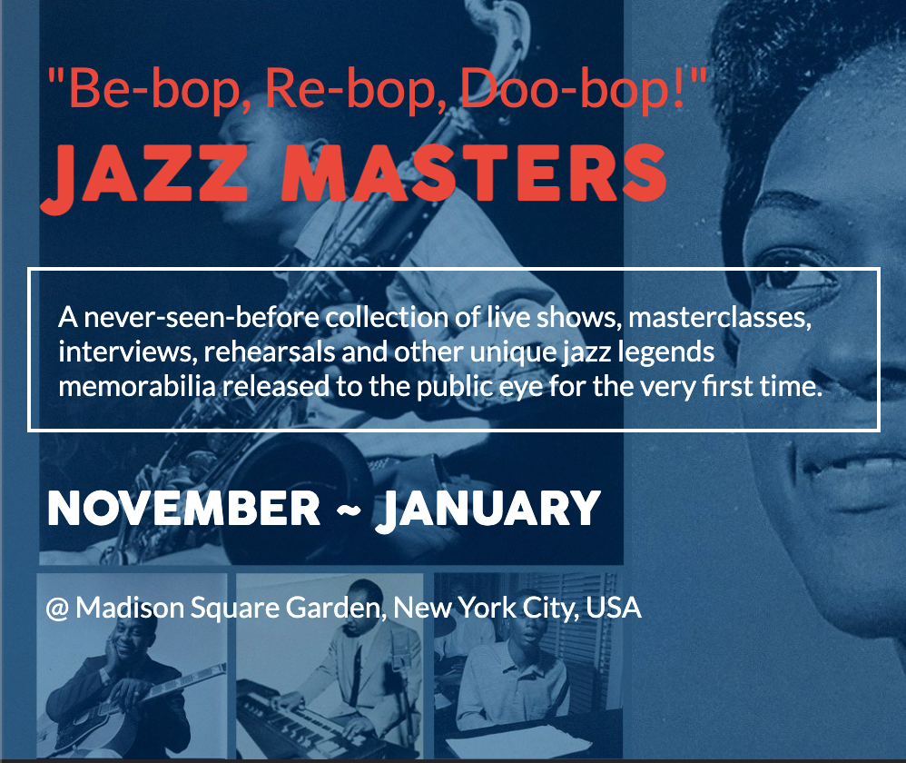

# Capstone

> This is the Capstone Project for my first module in Microverse. This is a page about a fictional jazz concert where previously unreleased footage will be debuted for the world to see.

If you want to check the full page, please follow [this link](https://vechicin.github.io/Capstone/). 

## Built With

- HTML, CSS and Javascript

## Authors

👤 **Santiago Velosa**

- GitHub: [@vechicin](https://github.com/vechicin)
- Twitter: [@vechicin](https://twitter.com/vechicin)
- LinkedIn: [Santiago Velosa Arias](https://www.linkedin.com/in/santiago-velosa-arias-5b7543112/)

## 🤝 Contributing

Contributions, issues, and feature requests are welcome!

Feel free to check the [issues page](https://github.com/vechicin/Hello-Microverse/issues).

## Show your support

Give a ⭐️ if you like this project!

## Acknowledgments

- Cindy Shin for her work, which deeply inspired the design for this website

## 📝 License

This project is [MIT](./MIT.md) licensed.
